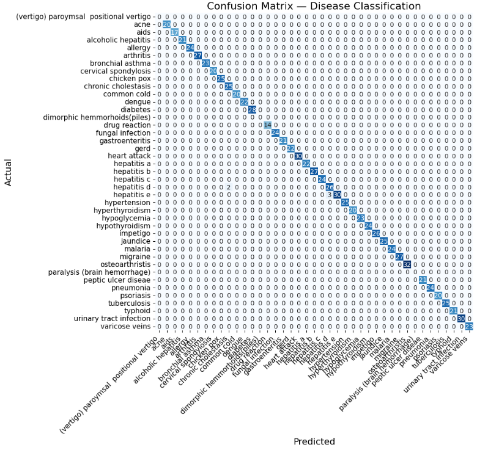

# **LLM Fine-Tuning with QLoRA**

This project demonstrates fine-tuning an open-source LLM (Mistral 7B) using **QLoRA** on Google Colab.
The objective is to train the model to **predict the most likely disease** from a list of symptoms.
The model was trained on a structured medical-symptom dataset and optimized for instruction-following behavior.

Using lightweight parameter-efficient fine-tuning (QLoRA), the model was able to learn strong symptom-to-disease mappings while keeping GPU usage minimal. After training for **2 epochs**, the fine-tuned model achieved an impressive accuracy of **99.49%** on the test set.

---

## **Model Used** - **Mistral 7B**

## **Dataset**

This Dataset has been taken from kaggle : hƩps://www.kaggle.com/datasets/choongqianzheng/disease-and-symptomsdataset?select=DiseaseAndSymptoms.csv
The final jsonl dataset contains instruction-style samples in the format:

```json
{
  "instruction": "Identify the disease pattern based on symptoms.",
  "input": "fever, headache, body pain",
  "output": "Disease: dengue\nExplanation: These symptoms frequently match dengue patterns in the dataset.\nNote: This is not medical advice."
}
```

* `train.jsonl` — used for fine-tuning
* `test.jsonl` — used for evaluation

---

## **Training Process (Summary)**

### **1. Prepare Dataset**

* Process the CSV file to get the data in the required format
* Prepare `train.jsonl` and `test.jsonl` using HuggingFace `load_dataset`.

### **2. Configure QLoRA / LoRA**

* Use 4-bit quantization (`bitsandbytes`)
* Apply LoRA to `q_proj`, `k_proj`, `v_proj`, `o_proj`, and `gate_proj`

### **3. Fine-Tune the Model**

* Train for **2 epochs**
* Use **TRL SFTTrainer** for supervised fine-tuning
* Save the LoRA adapter to Google Drive

### **4. Evaluate**

* Generate predictions on `test.jsonl`
* Compare predicted disease vs. actual disease
* Compute accuracy
* Generate **confusion matrix**

---

## **Confusion Matrix**




---

## **Sample Demo Output**

Example model query:

**Input Symptoms:**

```
Fever, headache, body pain
```

**Model Output:**

```
Answer: Dengue
Explanation: These symptoms frequently match Malaria patterns in the dataset.
Note: This is not medical advice.
```

## **Requirements**

* Google Colab
* transformers
* peft
* bitsandbytes
* trl
* datasets

